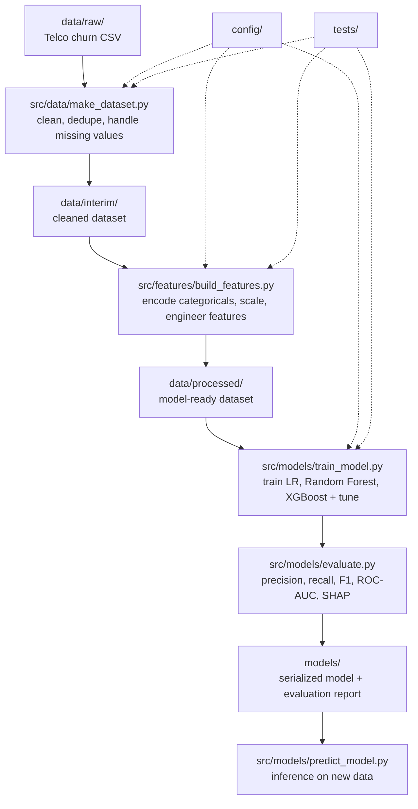

# Pipeline architecture — customer churn prediction

This document describes the end-to-end training pipeline: how raw data becomes a
scored, evaluated model. It is the design-level companion to the README, which
covers setup and usage.

## Data flow

## Stage responsibilities

| Stage | Script | Input | Output | Responsibility |
|---|---|---|---|---|
| Ingest | `src/data/make_dataset.py` | `data/raw/*.csv` | `data/interim/` | Drop duplicates, fix dtypes (e.g. `TotalCharges`), handle missing values. Logs row counts before/after. |
| Feature engineering | `src/features/build_features.py` | `data/interim/` | `data/processed/` | Encode categoricals, scale numerics, derive features. Fit transformers on train split only — no leakage. |
| Training | `src/models/train_model.py` | `data/processed/` | `models/*.pkl` | Train Logistic Regression, Random Forest, XGBoost. Handle class imbalance. Hyperparameter tuning via config. |
| Evaluation | `src/models/evaluate.py` | `models/*.pkl` + test split | `reports/` | Precision, recall, F1, ROC-AUC, confusion matrix, SHAP feature importance. |
| Inference | `src/models/predict_model.py` | `models/*.pkl` + new data | predictions | Loads saved artifact, applies same feature pipeline, scores new records. |

## Cross-cutting concerns

- **`config/`** — all file paths, model hyperparameters, and random seeds are defined here (e.g. `config.yaml`), not hardcoded in scripts. Every stage above reads from it.
- **`tests/`** — unit tests validate that cleaning drops the expected duplicates/nulls, that feature engineering doesn't leak the target, and that the training script produces a model meeting a minimum sanity threshold.
- **Logging** — each stage logs input/output row counts and key decisions (e.g. rows dropped, columns encoded) so pipeline runs are auditable without re-reading code.

## Why this structure

Splitting ingestion, feature engineering, training, and evaluation into separate
scripts (rather than one monolithic notebook) means each stage is independently
testable, re-runnable, and reviewable — the standard a production ML pipeline is
held to.
