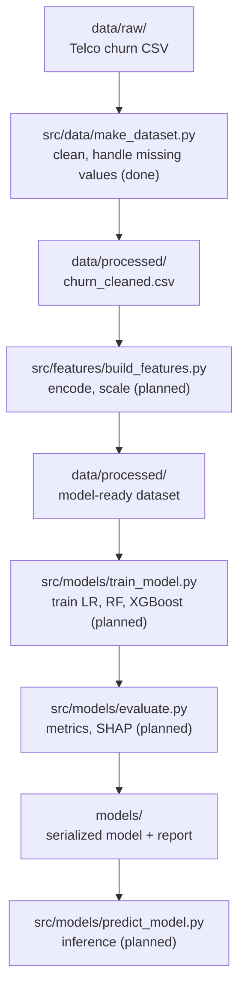

# Pipeline architecture — customer churn prediction

This document describes the end-to-end training pipeline: how raw data becomes a
scored, evaluated model. It is the design-level companion to the README, which
covers setup and usage.

**Status:** this reflects what's actually built today, not the final target. Each
stage below is marked `(done)` or `(planned)`. As each stage gets built, update its
status and details here rather than describing it ahead of the code.

## Data flow

## Stage responsibilities

| Stage | Script | Status | Input | Output | Responsibility |
|---|---|---|---|---|---|
| Ingest + clean | `src/data/make_dataset.py` | **Done** | `data/raw/*.csv` | `data/processed/churn_cleaned.csv` | Fix `TotalCharges` dtype, fill missing values via `tenure × MonthlyCharges`, drop duplicates (none found currently), drop `customerID`. |
| Feature engineering | `src/features/build_features.py` | Planned | `data/processed/churn_cleaned.csv` | `data/processed/` (features) | Collapse "No internet service" categories, one-hot encode, scale numerics. Fit transformers on train split only — no leakage. |
| Training | `src/models/train_model.py` | Planned | processed features | `models/*.pkl` | Train Logistic Regression, Random Forest, XGBoost. Handle class imbalance with `class_weight='balanced'` on the training split only. |
| Evaluation | `src/models/evaluate.py` | Planned | `models/*.pkl` + test split | `reports/` | Precision, recall, F1, ROC-AUC, confusion matrix, SHAP feature importance. |
| Inference | `src/models/predict_model.py` | Planned | `models/*.pkl` + new data | predictions | Loads saved artifact, applies same feature pipeline, scores new records. |

Note: `make_dataset.py` currently writes straight to `data/processed/`, not
`data/interim/`. An interim stage may be introduced later if feature engineering
needs an intermediate checkpoint — not needed yet.

## Cross-cutting concerns (planned, not yet built)

These are intentionally **not** implemented yet. Adding them now, with only one
script written, would be premature — they earn their place once 2-3 scripts
exist and actually need to share settings.

- **`config/`** — once introduced, will hold file paths, model hyperparameters, and random seeds, so nothing is hardcoded across scripts.
- **`tests/`** — unit tests are the next planned addition, ahead of config: validating that `clean_data()` fills `TotalCharges` correctly, drops duplicates, and leaves no missing values.
- **Logging** — `make_dataset.py` currently uses `print()` for status messages. A shared logger (timestamps, severity levels) is a later upgrade once there's more than one script's output to keep track of.

## Why this structure

Splitting ingestion, feature engineering, training, and evaluation into separate
scripts (rather than one monolithic notebook) means each stage is independently
testable, re-runnable, and reviewable — the standard a production ML pipeline is
held to.
